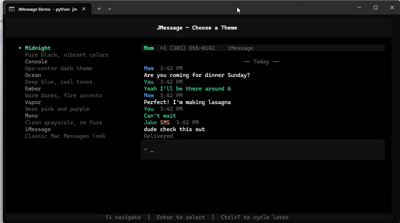

<div align="center">

# JMessage

**The world's first multiplatform, terminal-native iMessage client.**

Read, send, and manage iMessages from any machine — Windows, Linux, or SSH — with a fast, keyboard-driven TUI.



[](https://www.python.org/downloads/)
[](https://textual.textualize.io/)
[](LICENSE)

</div>

---

## Why JMessage?

Every other iMessage-on-PC solution is a GUI app. JMessage is the **only terminal-native iMessage client** — built for developers who live in the terminal and want their messages accessible from SSH sessions, tmux panes, or any machine with a keyboard.

A lightweight Python relay runs on your Mac, watching `chat.db` and sending via AppleScript. A [Textual](https://textual.textualize.io/) TUI connects over encrypted WebSocket from anywhere.

```
┌──────────────────┐       wss:// (mTLS)       ┌──────────────────┐
│    Mac Relay      │ ◄──────────────────────► │   TUI Client      │
│                   │                           │   (any terminal)  │
│  chat.db polling  │                           │   Textual UI      │
│  AppleScript send │                           │   keyboard-only   │
│  Contacts lookup  │                           │   7 themes        │
└──────────────────┘                           └──────────────────┘
```

## Features

| Category | Details |
|----------|---------|
| **Messaging** | Send & receive iMessages and SMS, optimistic send, delivery status, tapback reactions |
| **Navigation** | Esc: conversation list, Tab/Shift+Tab: cycle chats, Up/Down: scroll, /: search |
| **Themes** | 7 built-in themes (Midnight, Console, Ocean, Ember, Vapor, Mono, iMessage) — Ctrl+T to cycle |
| **Contacts** | Phone numbers auto-resolved to names from Mac's AddressBook (~30ms) |
| **Colors** | Blue sender names for iMessage, green for SMS — just like the real thing |
| **Attachments** | Ctrl+A: browse all attachments, download individually or bulk zip, URL extraction |
| **Search** | Ctrl+F: full-text search across all conversations |
| **Persistence** | Last conversation, theme, and filter settings remembered across restarts |
| **Status Bar** | Always-visible green/red connection indicator, unread count, message count |
| **Filtering** | Tab: hide unknown numbers, show only named contacts, emails, and groups |
| **Options** | Ctrl+O: theme, bell, history limit, connection info |
| **Cross-platform** | Works in cmd, WezTerm, iTerm2, Termius, PuTTY, tmux — any terminal |

## Network Security

> **Tailscale is HIGHLY recommended.** JMessage uses mTLS encryption, but exposing the relay to the open internet is strongly discouraged. Use [Tailscale](https://tailscale.com) (or another WireGuard mesh VPN) so the relay is only reachable from your own devices — no port forwarding, no public exposure.

| Layer | Protection |
|-------|-----------|
| Network | **Tailscale** — private encrypted mesh |
| Transport | TLS 1.3 WebSocket (mandatory — relay refuses plaintext) |
| Authentication | Mutual TLS — client cert signed by your CA |
| Authorization | Token verified on connect (env var, no default) |
| Input safety | AppleScript injection prevented via `on run` args |
| Data | Parameterized SQL, Rich markup escaped, attachment paths stripped |

## Requirements

> **You need a Mac.** JMessage requires a Mac with iMessage signed in to act as the relay. The relay (`mac-relay/relay.py`) is included in this repo — it runs on your Mac and bridges iMessage to any terminal client over WebSocket. The Mac must be powered on and network-accessible for JMessage to work.

| Component | What you need |
|-----------|--------------|
| **Mac (relay)** | macOS with iMessage signed in, Python 3.9+, `websockets` package, Full Disk Access granted to Terminal |
| **Client (TUI)** | Any machine — Windows, Mac, or Linux. Python 3.11+, `textual` and `websockets` packages |
| **Network** | Both machines on the same LAN, or connected via [Tailscale](https://tailscale.com) (strongly recommended) |

**The TUI client can run on the same Mac as the relay, on a Windows PC, on a Linux box, or over SSH — anywhere you have a terminal and Python.**

## Quick Start

### 1. Mac Relay

```bash
# Install
mkdir -p ~/jmessage-relay/logs
pip3 install websockets
cp mac-relay/relay.py ~/jmessage-relay/

# Grant Full Disk Access: System Preferences → Privacy & Security → Full Disk Access → Terminal

# Generate mTLS certificates
cd ~/jmessage-relay && mkdir certs && cd certs
openssl genrsa -out ca.key 4096
openssl req -x509 -new -key ca.key -days 730 -out ca.pem -subj '/CN=JMessage CA'
openssl genrsa -out server.key 2048
openssl req -new -key server.key -out server.csr -subj '/CN=jmessage-relay'
echo "subjectAltName=IP:YOUR_MAC_IP" > server.ext
openssl x509 -req -in server.csr -CA ca.pem -CAkey ca.key -CAcreateserial \
  -out server.pem -days 730 -extfile server.ext
openssl genrsa -out client.key 2048
openssl req -new -key client.key -out client.csr -subj '/CN=jmessage-client'
openssl x509 -req -in client.csr -CA ca.pem -CAkey ca.key -CAcreateserial \
  -out client.pem -days 730
rm -f *.csr *.ext *.srl

# IMPORTANT: Move ca.key somewhere safe after generating certs

# Start
cd ~/jmessage-relay
export JMESSAGE_TOKEN="your-secret-token"
python3 relay.py
```

### 2. TUI Client

```bash
cd tui
pip install -r requirements.txt

# Copy certs from Mac
mkdir certs
scp your-mac:~/jmessage-relay/certs/{ca.pem,client.key,client.pem} certs/

# Configure
cp config.example.json config.json
```

Edit `config.json`:
```json
{
  "relay_url": "wss://YOUR_MAC_IP:8765",
  "auth_token": "your-secret-token",
  "certs": {
    "ca": "certs/ca.pem",
    "client_cert": "certs/client.pem",
    "client_key": "certs/client.key"
  }
}
```

```bash
python jmessage.py
```

On first launch you'll pick a theme. Then press Esc to see your conversations.

## Hotkeys

<table>
<tr><th>Conversation</th><th>Conversation List</th><th>Global</th></tr>
<tr><td>

| Key | Action |
|-----|--------|
| Esc | Conversation list |
| Tab | Next conversation |
| Shift+Tab | Previous conversation |
| Up/Down | Scroll messages |
| Enter | Send message |
| Ctrl+N | New conversation |
| Ctrl+A | Attachments |
| Ctrl+F | Search messages |

</td><td>

| Key | Action |
|-----|--------|
| Up/Down | Navigate |
| Enter | Open |
| Tab | Known-only filter |
| / | Search by name |
| Left/Right | Top/bottom |
| Esc | Back |

</td><td>

| Key | Action |
|-----|--------|
| Ctrl+T | Cycle theme |
| Ctrl+O | Options |
| Ctrl+H | All hotkeys |
| Ctrl+C | Quit |

</td></tr>
</table>

## Architecture

```
mac-relay/
  relay.py              ← Watches chat.db, sends via AppleScript, resolves contacts

tui/
  jmessage.py           ← App entry point, config, message routing
  client.py             ← WebSocket client, mTLS, auto-reconnect
  themes.py             ← 7 color themes
  screens/
    conversation.py     ← Message display, input, status bar
    conversation_list.py← Conversation picker, search, filter
    attachments.py      ← Attachment browser, download, zip
    search.py           ← Full-text message search
    new_conversation.py ← Start new chat (Ctrl+N)
    theme_picker.py     ← First-run theme selection
    options.py          ← Settings (Ctrl+O)
```

### Protocol

JSON over WebSocket — simple request/response with server-push for new messages:

```json
{"type": "auth", "token": "..."}
{"type": "get_conversations"}
{"type": "get_history", "data": {"chat_id": "+1234567890", "limit": 50}}
{"type": "send", "data": {"chat_id": "+1234567890", "text": "Hello!"}}
{"type": "message", "data": {"text": "Hi!", "sender": "Mom", ...}}
```

## How It Compares

| Project | Approach | Needs Mac? | UI | Stars |
|---------|----------|-----------|-----|-------|
| **JMessage** | chat.db + AppleScript | Yes | **Terminal (TUI)** | - |
| BlueBubbles | Private API | Yes | GUI apps | ~900 |
| AirMessage | Swift relay | Yes | Android/Web | ~600 |
| pypush | Protocol RE | No | Library | ~3.7K |

JMessage is the only **terminal-native** option. No Electron, no browser, no mobile app — just your terminal.

## Apple Compatibility

JMessage uses only official macOS interfaces — AppleScript for sending, SQLite for reading chat.db and AddressBook, Full Disk Access permissions. No protocol reverse-engineering, no SIP disabling, no direct connection to Apple servers. The relay is an automation layer on top of Messages.app, similar to Automator or Shortcuts.

## License

[MIT](LICENSE)
